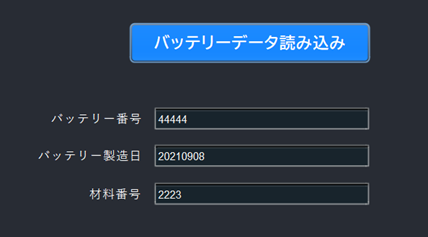
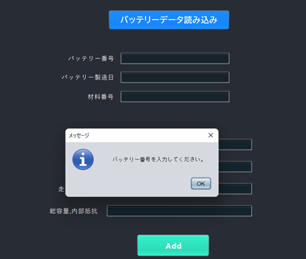
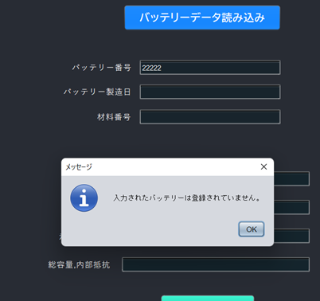
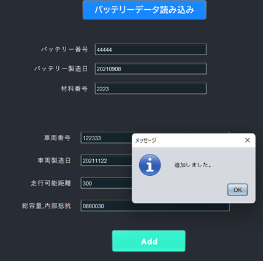
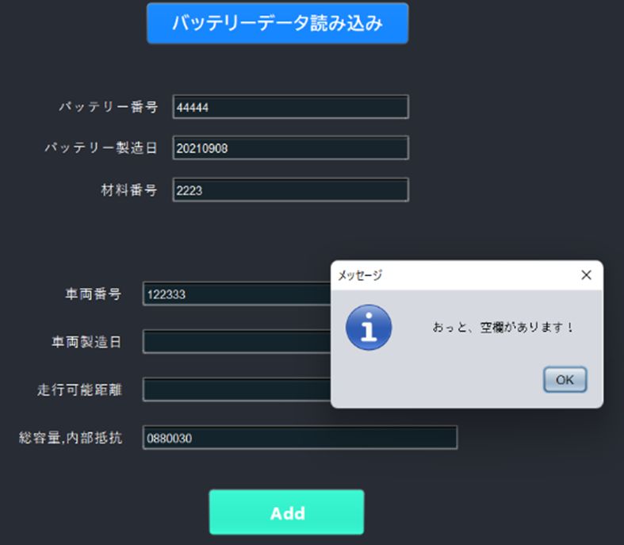
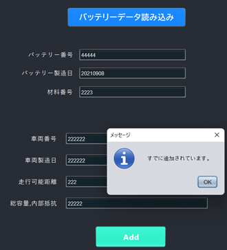
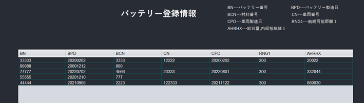

## Battery Electric Vehicle Supply Chain Management System (BEVSCMS) application prototype

This is a prototype development of Supply chain management system application for EV batteries including recycling.

This application is developed in NetbeansIDE using Java.

### 1.Function

- Transition from the splash window (temporary loading view) to the login window.

- User IDs and passwords are centrally managed by a management organization (e.g. car manufacturer) and inquired when necessary (cannot be changed or added arbitrarily).

- If the ID or password is incorrect, a warning will be displayed.

- Jump to the Web application form(not ready yet) by clicking the SignUp button.

- You can login with USER_ID: admin and PASSWORD: admin. You can move to the Home view and check the explanation and how to use it(Japanese).

- Return to the login window with the Logout button.

- Exit with the X button on the upper right.

- Register battery information in the Register view.

- If there are blanks or the already registered battery number is entered, a warning will be displayed.  
  If there is no problem, "登録しました！" is displayed.

  

- In the Add view, you can read registered battery information and add vehicle information.

- When you press the "バッテリーデータ読み込み" button after entering battery number, the manufacturing date and material number are automatically entered.

- If you press the button without entering the battery number, a warning will be displayed.

- If you enter an unregistered battery number and press the button, a warning will be displayed.

- After the data is automatically entered, enter other additional information and press the Add button to add the information.   
  If there is no problem, "追加しました。" is displayed.
  

- If there are blanks, a warning will be displayed.

- If you try to add new information when other information(Vehicle number, etc.) has already been added, a warning will be displayed.  
  (This is because this system assumes a blockchain system. Basically, registration and addition are only done once, and deletion and modification of information are carefully done after verification.)

- In the View window, you can check the registered battery information.  
  - All information is managed in Int type.

- You can move to any page(Home, Register, Add, View) with the button on the left bar.(input information is not retained)

