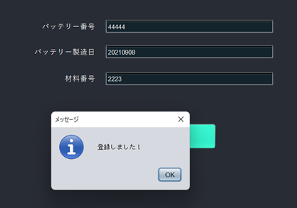

## Battery Electric Vehicle Supply Chain Management System (BEVSCMS) application prototype

This is a prototype development of Supply chain management system application for EV batteries including recycling.

This application is developed in NetbeansIDE using Java.

### Function

- Transition from the splash window (temporary loading view) to the login window.

- User IDs and passwords are centrally managed by a management organization (e.g. car manufacturer) and inquired when necessary (cannot be changed or added arbitrarily).

- A warning is displayed if the ID or password is incorrect.

- Jump to the Web application form(not ready yet) by clicking the SignUp button.

- You can login with USER_ID: admin and PASSWORD: admin. You can move to the Home view and check the explanation and how to use it(Japanese).

- Return to the login window with the Logout button.

- Exit with the X button on the upper right.

- Register battery information in the Register view.

- When you press the register button, a warning is displayed in the following cases.    
    when there is a blank.    
    When the already registered battery number is entered.    
    If there is no problem, display "登録しました！"

  
